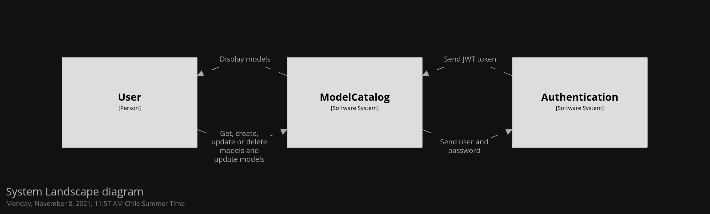
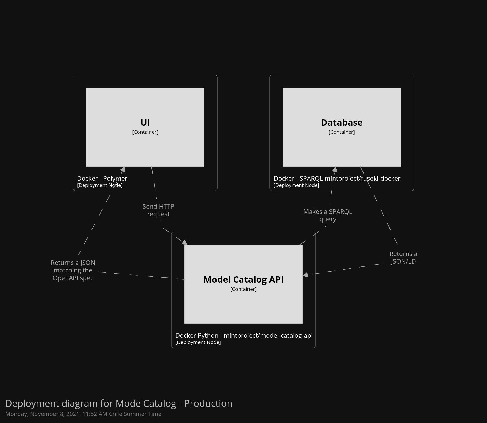
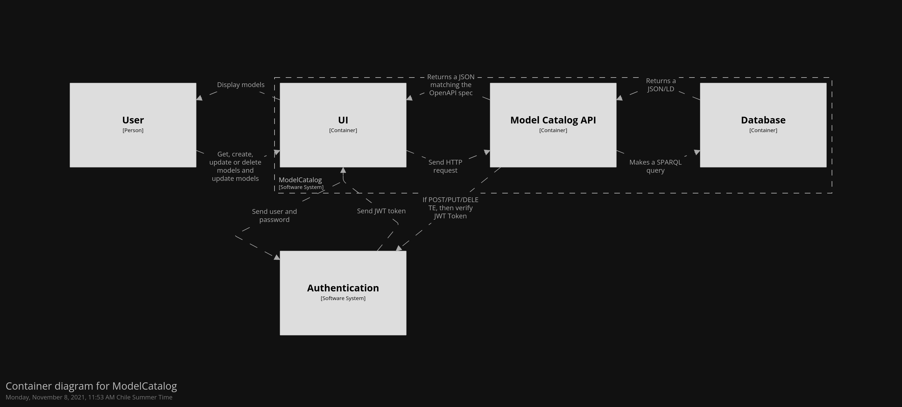

# Model Catalog Technologies

---

The MINT Model Services describe physical, environmental and social models

---

# Ontologies

We have developed two main ontologies to help structure the metadata and contents of the model catalog:

#### Software Description Ontology (SD)
Ontology used to capture the overall metadata of scientific software, including its versions, functionality, inputs, outputs, etc.  [[Documentation](https://w3id.org/okn/o/sd)] 

#### Software Description Ontology for Models (SDM)
Extension of the Software Description Ontology to capture metadata specific to models (e.g., the region where they are valid, their spatial grid, their temporal restrictions, etc.). [[Documentation](https://w3id.org/okn/o/sdm/)]

---

# Model Catalog API

Model Catalog API for adding/modifying/deleting model metadata. We provide several clients (available [here](http://mint-project.info/products/model/#model-service-api-clients)) to improve the experience for developers when accessing the contents of our APIs.

[[RESTAPI](https://api.models.mint.isi.edu/latest)] [[Documentation](https://model-catalog-python-api-client.readthedocs.io/en/latest/endpoints/)] [[Code](https://github.com/mintproject/model-catalog-api)] [[Releases](https://github.com/mintproject/model-catalog-api/releases)]

--- 

# Model Catalog Explorer

GUI for browsing the contents of the model catalog

[[Website](https://models.mint.isi.edu/home)] [[Demo](https://www.youtube.com/watch?v=C9rxGT2k9is)]

Registered users can add, edit, and remove metadata of their models, as well as creating new model setups, for example, adapting an existing model to a new region.

--- 

# System

--- 

# Deployment

---

# More details

----

# Repository

 - [API](https://github.com/mintproject/model-catalog-api)
 - [UI](https://github.com/mintproject/model-catalog-explorer)
 - [Database container](https://github.com/mintproject/fuseki-docker)

 ----

 # Issues

 - Using urllib2 led to the code running sequentially and synchronously. [Reported](https://github.com/RDFLib/sparqlwrapper/issues/157)

---- 

# Future work

Improve perfomance

- Move API from Python to Nodejs. The tools are better and they run async.

[SPARQLjs](https://github.com/RubenVerborgh/SPARQL.js)

----

# Future work

Use Linked Data Plataform ([Trellis](https://github.com/trellis-ldp/trellis))

1. Resources are managed by means of a RESTful HTTP API,
2. An HTTP client is also able to retrieve the historical state [Resource versioning](https://github.com/trellis-ldp/trellis/wiki/Resource-Versioning) and [provenance(audit) feature ](https://github.com/trellis-ldp/trellis/wiki/Resource-Provenance--(Audit))
3. Authentication and Authorization can be easier [Docs](https://github.com/trellis-ldp/trellis/wiki/Authentication)